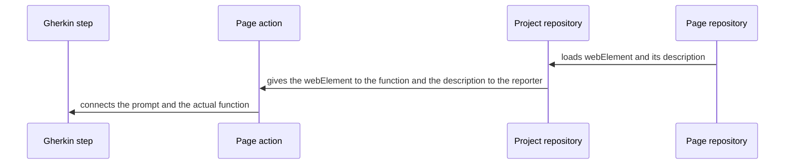

# Exercice_HighTest

This project was created in order to practice my automation skills.
It was designed with a Page Object Model pattern and uses text recognition technology to reproduce
an end to end usage of both HighTest and LinkedIn websites.

## 1. Context introduction and given instructions

The exercice's goal is to ensure an email is sent with a score of 100% of good answers when we fulfill one of HighTest's
ISTQB quizz with correct answers.

The initial instruction gave Yopmail as the mean to open the email and
check for the answer, however, as the usage of a temporary email adresses
is not compatible with my current company's computer policy, I propose an
alternative solution : creating a false account on LinkedIn where I would post
the received email as an image, and use the messaging chat window as a support for automation
to open the media, transcript the image into text and check for the result.

## 2. Implementation of the POM (Page Object Model) pattern

As its name suggests, with the POM pattern, each webpage's automation is designed
with a dedicated class, containing its webElements and actions. I decided to
separate each webpage's actions and webElements in different classes
for a clarity purpose. Thus, each page action will load a local context
from the page repository, where the useful elements it needs are located.
As the local context is loaded, all the webElements are added with a
description to the project repository so that we can easily re-use them and
know precisely what we interact with in the execution report.

The construction of my code is synthesized with the following flowchart :

## 3. Solution design

I prompted the workflow with Gherkin langage, where each sentence is linked to a set of actions.
As the actions are triggered, an overlay located in the AutomTools class uses the description of
each used webElement from the project repository to construct the execution report,
and log exceptions in case of failure.

A conditional hook was created in the TestRunner class to act as a "listener"
and take a screenshot called _screenShotOfError_ if the scenario fails. In addition, it monitors the error in the
report.

The test execution report and all the screenshots can be accessed in the folder
located at the path : src/test/resources/output.

## 4. Test launch

1. Clone remote project to your local desktop : "git clone https://github.com/U501295/Exercice_HighTest.git"
2. Open a terminal on the "Parcours_IHM_Hightest" folder, ensure you have a valid JAVA 17 JDK, and use the following
   instruction "mvn clean install"
